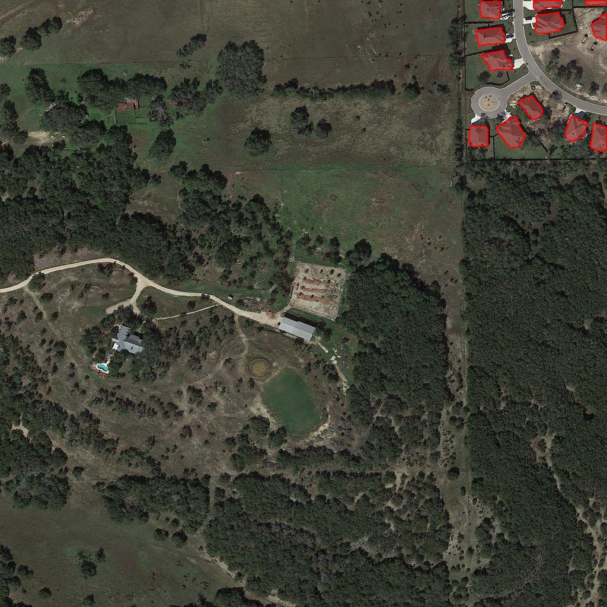

# GeoSeg-Agent

[](https://github.com/Emilsdeyta/geoseg-agent/actions/workflows/ci.yml)

Satellite change detection end to end: a Siamese U-Net finds what changed between two
images, a geo-inference pipeline turns the pixel mask into GeoJSON polygons, a report
generator explains the result in plain language, and a FastAPI service (with a CPU-only
Docker image) serves it all.



*Predicted change regions (12 polygons) drawn over the "after" image of LEVIR-CD `test_1`.
The outlines follow the roofs of the newly built houses; unchanged areas stay clean.*

## What it does

```
before.png ─┐
            ├─► Siamese U-Net ─► change mask ─► polygons (GeoJSON) ─► text report
after.png  ─┘   (tiled inference)               (marching squares)    (rule-based)
                                        └────────────── FastAPI  /predict ──────────┘
```

| Component | Status | Where |
|---|---|---|
| Change-detection model (Siamese U-Net, shared ResNet34 encoder, `\|f_A - f_B\|` fusion, Dice + Focal loss) | Done | `src/geoseg/models`, `src/geoseg/training` |
| Evaluation and error analysis | Done | `src/geoseg/evaluation` |
| Full-image tiled inference and mask → GeoJSON | Done | `src/geoseg/inference` |
| Natural-language report | Done (rule-based, no LLM) | `src/geoseg/agent` |
| REST API + CPU Docker image | Done | `src/geoseg/api`, `Dockerfile` |
| LLM-backed agent | Not implemented (see [Roadmap](#roadmap)) | — |

## Results

Trained on [LEVIR-CD](https://justchenhao.github.io/LEVIR/) (Kaggle, Tesla T4, 50 epochs,
best checkpoint at epoch 42). Numbers below are on the 128 held-out test image pairs.

| Metric (change class) | Value |
|---|---|
| IoU (tile-level, pooled) | **0.818** |
| F1 | **0.900** |
| Precision | 0.912 |
| Recall | 0.889 |

Details, including why the per-image IoU is lower and what the model gets wrong, are in
[Evaluation & Error Analysis](#evaluation--error-analysis).

## Quick start

```bash
python -m venv .venv
.venv\Scripts\activate      # Linux/Mac: source .venv/bin/activate
pip install -e ".[dev,api,geo]"
pytest -m "not gpu and not slow"
```

Running the model needs the `ml` extra (PyTorch, segmentation-models-pytorch) and a trained
checkpoint. The checkpoint is not stored in this repository.

### 1. Change regions as GeoJSON (CLI)

```bash
python -m geoseg.inference.run \
    --image-a data/raw/levir-cd/test/A/test_1.png \
    --image-b data/raw/levir-cd/test/B/test_1.png \
    --checkpoint outputs/full_run/best.pt \
    --output result.geojson
```

Tile size and threshold default to the values stored in the checkpoint. Add `--min-area N`
to drop polygons smaller than N px². On `test_1` this produces 12 polygons covering
12,560 px² in about 3 seconds on a laptop CPU.

### 2. Plain-language report (CLI)

```bash
python -m geoseg.agent.cli --geojson result.geojson \
    --metrics outputs/full_run/test_metrics.json --image-name test_1.png
```

### 3. REST API

```bash
set GEOSEG_CHECKPOINT=outputs\full_run\best.pt
set GEOSEG_METRICS=outputs\full_run\test_metrics.json   # optional, adds model metrics to the report
uvicorn geoseg.api.main:app --port 8000
```

| Endpoint | Description |
|---|---|
| `GET /health` | Liveness, and whether a checkpoint is loaded |
| `POST /predict` | Multipart upload of `image_a` (before) and `image_b` (after); optional `threshold` (0-1) and `min_area` form fields |

```bash
curl -X POST http://localhost:8000/predict \
  -F "image_a=@test_1_A.png" -F "image_b=@test_1_B.png" -F "threshold=0.5"
```

The response contains `geojson`, `report`, `n_polygons`, `changed_area_px` and the
`threshold` used. For `test_1`:

> In test_1.png, 12 change regions were detected, covering a total area of about 12560 px^2.
> The largest region is about 1618 px^2 (large). On average, each region covers about 1047
> px^2, ranging from 308 to 1618 px^2. For reference, on the held-out test set this model
> achieves an IoU of 0.82 and F1 of 0.90, so individual predictions should be read with that
> overall accuracy in mind. Note on reliability: this model is known (from held-out test-set
> error analysis) to sometimes miss very small changed objects, and can occasionally flag
> bare soil or construction-like surfaces as false changes. Treat flagged regions as
> candidates for review, not as a final verdict.

Interactive docs are served at `http://localhost:8000/docs`. The checkpoint is loaded once at
startup. Without `GEOSEG_CHECKPOINT` the server still starts, and `/predict` answers `503`.

### 4. Docker (CPU-only)

```bash
docker build -t geoseg-agent .
docker run -p 8000:8000 -v <path-to>/outputs/full_run:/models geoseg-agent
```

The image uses CPU PyTorch wheels, so it needs no GPU or paid cloud instance. The checkpoint
is mounted, not baked into the image. I built the image and ran the same `test_1` request
against the container locally; it returned the same 12 polygons as the non-Docker run.

## Design decisions

- **Polygonization uses marching squares, not `cv2.findContours`.** OpenCV traces pixel
  centres, which shrinks an N×N block to (N-1)×(N-1) — a systematic ~19% area error for a
  10×10 block. `skimage.measure.find_contours` at the 0.5 level gives ~99.5-100%. Masks
  touching the image border are padded by one pixel first so no polygon is left open.
- **Polygon nesting is fast.** A first version took 40 s on a realistic noisy mask (thousands
  of tiny components) because of an O(n²) containment check with uncached shapely calls.
  A bounding-box pre-filter and cached areas brought a 1024×1024 mask with 3,000 components
  to 0.57 s. A slow-marked regression test guards this.
- **The report is rule-based on purpose.** It is template text over structured facts
  (`summarize_geojson`), with a fixed reliability note taken from the error analysis. It costs
  nothing to run and cannot hallucinate. The structured summary is what an LLM layer could
  later call as a tool.
- **The API depends on a small predictor protocol, not on PyTorch.** Route logic is tested
  with a fake predictor, so the API tests run in CI without installing torch. The real
  `TorchPredictor` imports torch lazily and skips the ImageNet weight download, so the server
  also starts offline.

## Limitations

- **Not georeferenced.** LEVIR-CD has no geospatial metadata, so GeoJSON coordinates are pixel
  units (`x` = column, `y` = row) and the output says so (`crs: local-pixel`). Real-world
  coordinates would need a georeferenced input and an affine transform.
- Trained and evaluated on one dataset (LEVIR-CD, building change). Behaviour on other
  sensors, resolutions or change types is untested.
- Small changed objects are frequently missed (see the error analysis below).
- The "agent" is a template-based report generator; there is no LLM or tool-calling loop yet.
- No stronger backbone (e.g. SegFormer) or ablation study was run; results are for the single
  Siamese U-Net baseline.

## Evaluation & Error Analysis

### Test set results (LEVIR-CD, 128 held-out image pairs, unseen during training)

| Metric | Tile-level (pooled) | Per-image (macro-avg) |
|---|---|---|
| IoU | **0.818** | 0.738 |
| F1 | **0.900** | — |
| Precision | 0.912 | — |
| Recall | 0.889 | — |

The two IoU numbers differ because they weight pixels differently, not because of a bug:
- **Pooled/micro** sums TP/FP/FN across all 2,048 tiles before computing one ratio — images
  with larger changed areas contribute more.
- **Per-image/macro** computes IoU per image and averages 128 equally-weighted scores.
  Images with very small or zero change area are disproportionately punished by a single
  wrong pixel, which pulls the macro-average down. This is expected and common on
  imbalanced change-detection datasets, not a sign of a worse model.

Validation (model-selection) score at the best checkpoint (epoch 42/50): IoU 0.827, F1 0.905.
Test is slightly lower (0.818 / 0.900), a normal, healthy generalization gap.

### Qualitative error analysis (best/worst 5 test images, ranked by per-image IoU)

Out of 128 test images, 9 scored exactly 0.0 IoU. Inspecting these and the best-scoring
images directly revealed two recurring failure patterns:

1. **Missed small/subtle change objects (false negatives).** In several of the worst cases
   (e.g. `test_128`, `test_59`, `test_61`) the ground-truth change region is only a handful
   of pixels — a small building or structure — and the model predicts no change at all.
   This is the dominant cause of the zero-IoU cases: very small objects are easy to miss
   given the ~5% overall change-pixel ratio in the dataset.
2. **False positives on bare soil / construction-like surfaces.** In `test_62`, an
   already-built residential block contains a few patches of light-colored bare ground
   (likely a construction or landscaping area), which the model flags as multiple sizeable
   false-positive change regions even though ground truth marks no change there.
3. **Occasional seasonal-appearance confusion (weaker pattern).** In `test_60`, a strong
   before/after color shift in farmland (bare soil → green vegetation) triggers one small
   false positive. Notably, a very similar seasonal shift in `test_64` (one of the
   *best*-scoring images) is correctly ignored by the model — so seasonal color change
   alone isn't a reliable failure predictor; it appears to interact with local texture/shape.

**Caveat on the "best" examples:** most of the top-scoring images (IoU = 1.0) are simply
easy true negatives — no real change present in either image, and the model correctly
predicts nothing. This metric convention (0/0 defined as a perfect score) means the "best"
list reflects trivial correct rejections rather than the model's hardest successes; it is
included for completeness, not as evidence of exceptional performance on hard cases.

### Takeaways for future work
- Small/tiny changed objects are the largest single error source — worth exploring
  tile-size/overlap tuning, a small-object-aware loss term, or oversampling tiles with
  small positive regions.
- Bare-soil/construction misclassification suggests the model may be relying partly on
  simple brightness/texture cues rather than more robust structural change signals —
  a candidate direction for hard-negative mining if pursued further.

*Full ranking (`ranking.json`) and the 10 exported comparison images (best/worst 5) are
available in `outputs/full_run/error_analysis/`.*

## Project layout

```
src/geoseg/
  data/         tiling and LEVIR-CD dataset
  models/       Siamese U-Net
  training/     config, losses, metrics, trainer
  evaluation/   test-set evaluation, best/worst visualisation
  inference/    tiled prediction, mask -> GeoJSON, CLI
  agent/        rule-based report generator, CLI
  api/          FastAPI app, predictor wrapper, schemas
scripts/        GeoJSON overlay sanity-check
tests/          pytest suite (CI runs it without torch or GPU)
Dockerfile      CPU-only serving image
```

## Roadmap

- [x] Tile-based data pipeline
- [x] Baseline Siamese U-Net, trained and evaluated on LEVIR-CD
- [x] Change regions as GeoJSON polygons
- [x] Rule-based natural-language report
- [x] FastAPI service + CPU Docker image
- [ ] Optional LLM layer: free-tier model that calls `summarize_geojson` as a tool for
      free-form questions, with the rule-based report as fallback
- [ ] Stronger backbone (e.g. SegFormer) with ablations
- [ ] Georeferenced input support (affine transform to real-world coordinates)
